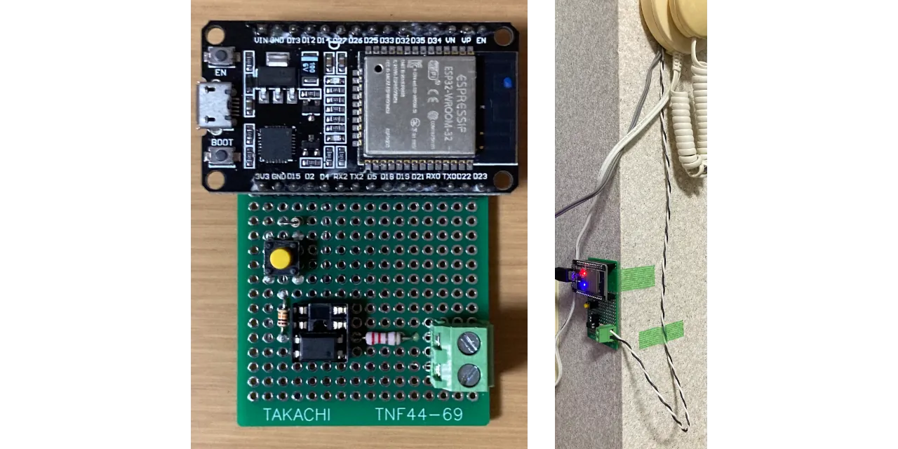
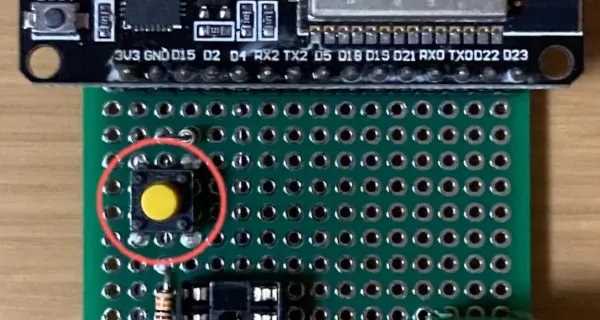
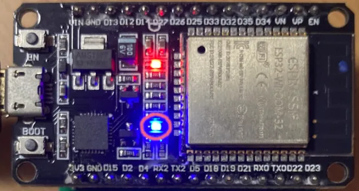
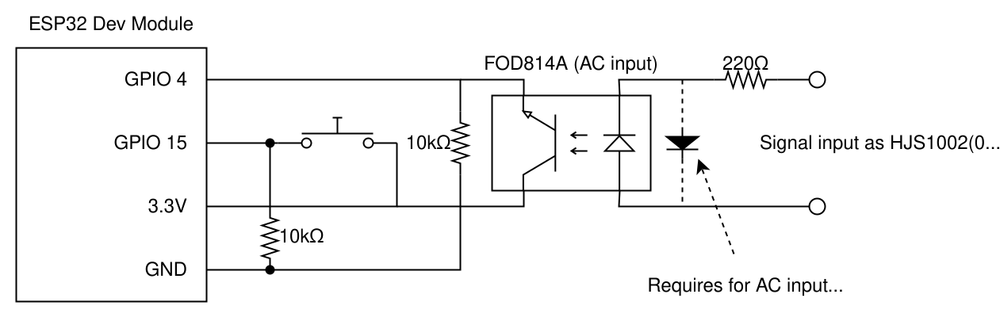
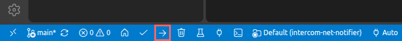
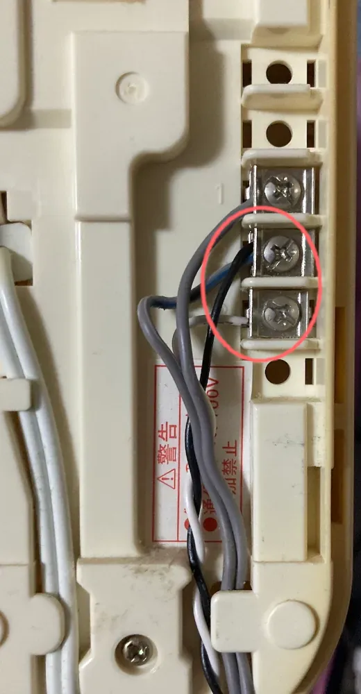
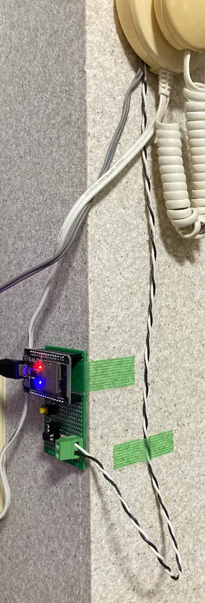

# Intercom Net Notifier

Home intercom notifier via Internet messenger DIY with ESP32



## Usage

### Test key



Press to dispatch messaging manually as a test.

### LED indication



- Slow blink (1sec period)
  - Could not detect Wi-Fi device
- Turn OFF
  - Wi-Fi not connected
- Turn ON
  - Wi-Fi connected
- Quick blink (200msec period)
  - Signal detected and messaging process dispatched

## Deployment

### Circuit wiring



### Set MCU communication secrets

Copy `include/comm_secrets_template.h` to `include/comm_secrets.h`, then fill out these values.

- `WIFI_SSID`
- `WIFI_PASS`
- `DISCORD_WEBHOOK_URL`
- `LINE_CHANNEL_ACCESS_TOKEN`

### MCU program uploading

Connect MCU (ESP32) and PC with USB cable.

Open repository root directory by [VSCode](https://code.visualstudio.com/) with [PlatformIO extension](https://marketplace.visualstudio.com/items?itemName=platformio.platformio-ide). Then upload.



Or you'd like to use CLI:

```sh
wget -O get-platformio.py https://raw.githubusercontent.com/platformio/platformio-core-installer/master/get-platformio.py
python3 get-platformio.py
rm get-platformio.py

pio run -t upload
```

### Install to intercom system

Wire circuit input and home intercom system signal output.





## Modification guide

### Circuit

#### MCU board

You can migrate to other MCU board of MCU32 Dev Module. Migration requirements are:

- It includes or connectable Arduino compatible Wi-Fi module
- It has compatible development environment of Arduino

#### Isolation circuit

Resistors value and photo-coupler type have to be adapted to intercom system signal output specification. If you say the intercom signal output is clean and same voltage level as MCU IO, may be you can connect it directly (but keep isolated them is safe for the MCU).

#### Test key circuit

It's optional. You can omit when it's unnecessary.

If you omit it, comment `main.c:13` line:

```cpp
#define TEST_KEY_ENABLE
```

### MCU program

#### PlatformIO config (when MCU board migrated)

`platform` and `board` selection in `platformio.ini` need to be modified with MCU board selection.

#### GPIO pin number

If you wish to use LED indication and the onboard (or external) LED pin is changed, `main.c:18` have to be changed with connected pin number.

```cpp
static const uint8_t  ONBOARD_LED     = 2;  // At ESP32 Dev Module
```

When you changed GPIO pin number with circuit wiring, `main.c:19~21` have to be changed with connected pin number.

```cpp
static const uint8_t  INTERCOM_SIG    = 4;
```

#### Messaging process

To add target messenger services, add posting function code via API to `lib/messenger_post_simple/messenger_post_simple.cpp/.h`. Then call it from `main.c:61~62`:

```cpp
discord_webhook_post(DISCORD_WEBHOOK_URL, "Doorbell rang");
line_broadcast_post(LINE_CHANNEL_ACCESS_TOKEN, "Doorbell rang");
```

I recommend separate secrets data (e.g. access token) to `include/comm_secrets.h`.

This program posts to Discord and LINE. If it unnecessary, delete or comment the/these line(s).

## License

[CC0 1.0](./LICENSE)
